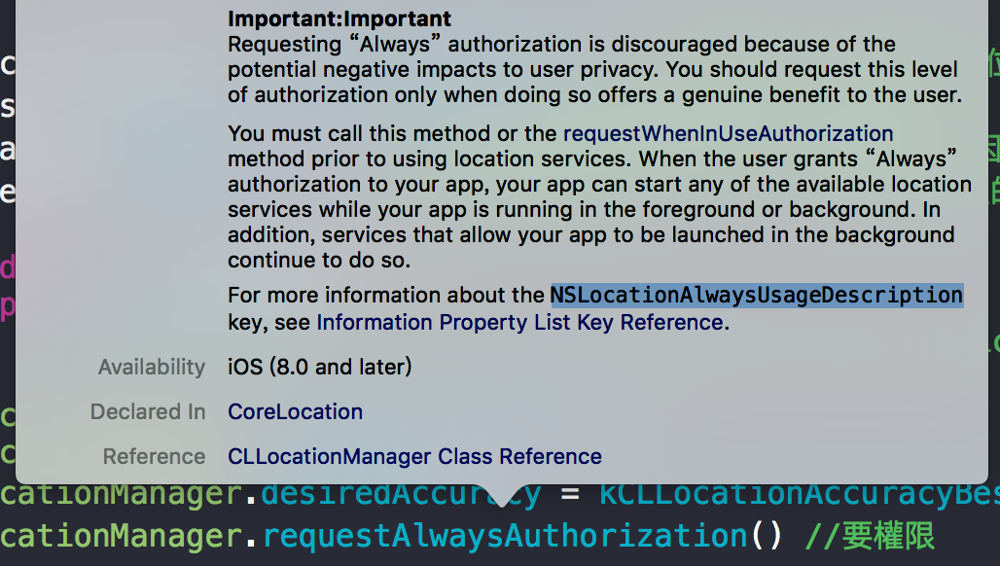
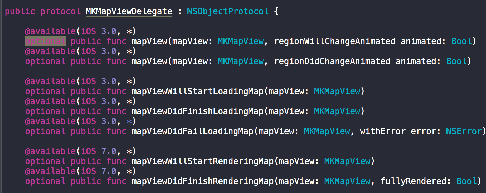

# MapKit
[hackmd](https://hackmd.io/p/SyDqn_VO#/)
## 專案中內容
> - 地圖相關操作
> - Geocorder 地址和座標互轉
> - 計算建議路線
> - 繪製路線

## 專案中使用到的觀念
> - IBOutlet
> - Delegate：用於事件處理，有點像Android的Listener
> - Closure
> - Optional

### - 權限要求
 - 前景時可使用Map
>  locationManager.requestWhenInUseAuthorization()
 - 任何時候使用Map
>  locationManager.requestAlwaysAuthorization()

> **注意**
> 
*iOS8以上*

需在 info.plist 加入 NSLocationAlwaysUsageDescription 或 requestWhenInUseAuthorization

 

 

### CLGecoder()
>有兩個功能
> - Address to Coondinate
> - Conndinate to Address

### P.S.
 - 觀察 Class 的 func 是否需實作 => 用 『command + 右鍵』 點擊 Class
 > 有 optional 不一定要實作
  
 

 - 註解使用 Swift
 > //MARK: MapView Delegate
 > 
//TODO: Hello
 > 
 
